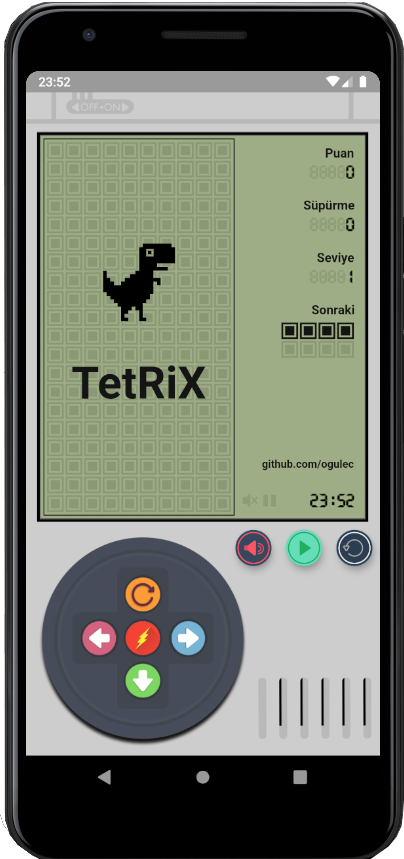

# TetRiX

**TetRiX** is a Retro Tetris game powered by 

It's a self Flutter learning fun-app which is re-designed and re-coded.

*Repo forked from* [boyan01/flutter-tetris](https://github.com/boyan01/flutter-tetris)

## **Preview**

## **Environment**

Coded & built on **VS Code**

Testbed Devices:

* **Pixel 3A API 28 Android 9**

* **Nexus 5X API 28 Android 9**

## **Credits**

Original release by [boyan01](https://github.com/boyan01)

Icons by [Smashicons](https://www.iconfinder.com/olivetty) & [Steve Schoger](https://www.iconfinder.com/iconsets/circle-icons-1) & [Creaticca Ltd](https://www.iconfinder.com/bendavis)
